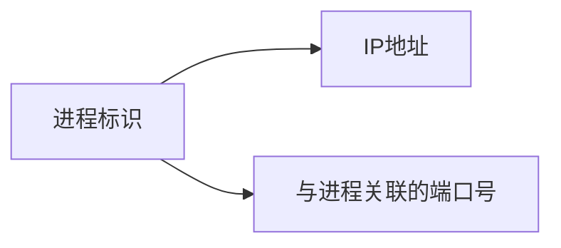

 

# 计算机网络期中知识总结

[TOC]

## Chapter1 总述

### 1.1 Internet

1. 具体构成

   ``` mermaid
   graph LR;
   应用层 --> 终端设备
   应用层 --> 通信链路
   应用层 --> 分组交换机
   路由("路由(序列)") --> 通信链路
   路由("路由(序列)") --> 分组交换机
   ISP("ISP(网络)") --> 分组交换机
   ISP --> 通信链路
   
   
   ```

   **Internet 是 按松散的层次组织结构、并且遵循TCP/IP协议的ISP集合**

2. 服务

   服务内容：

   * 源主机到目的主机的可靠数据交付
   * 尽力而为的数据交付

   **Internet是为分布式应用提供通信服务的基础设施**

3. 协议

   定义了通信实体之间交换的报文的格式和次序，以及在报文发送、接收或收到其他事件后采取的动作


### 1.2 网络边缘

	1. 接入网
 	2. 物理媒体


### 1.3 网络核心

	1. 定义：由路由器和通信链路形成的网状网络
 	2. 任务：将数据从<font color = "Blue">发送终端的边缘路由器</font>传输到<font color = "Blue">接收终端的边缘路由器</font>

#### 1.3.1 分组交换

交换机在接收到<font color = "red">整个分组</font>后才可以开始传输（<font color = "red">存储转发</font>）

条件：分组长度为$L$比特，链路速率为R b/s

	* 将一个分组全部推送到一条链路上，耗时为 $ \frac{L}{R} $
	* 将一个分组发送到目的地，耗时为$\frac{2L}{R}$
	* <font color = "red">$P$个分组经过$N$条链路耗时$\frac{(P+N-1)L}{R}$</font>

网络核心的重要功能：；

	* 选路（生成转发表）
	* 转发（按转发表移动分组）

<font color = "red">分组交换网络原理</font>

* <font color = "red">分组转发</font>
* <font color = "red">动态路由</font>
* <font color = "red">出错交由端系统</font>


#### 1.3.2 电路交换

<font color = "red">通信前预留好端到端资源</font>

<font color = "red">资源独占</font>


#### 1.3.3 网络的网络

端系统通过接入ISP与因特网相连

接入ISP必须相互连接


### 1.4 分组延迟、丢失和吞吐率（分组交换网络）

分组延迟来源：

	* 节点处理 d<sub>proc</sub>
	* 排队 d<sub>queue</sub>
	* 传输延迟 d<sub>trans</sub>
	* 传播延迟 d<sub>prop</sub>

端到端吞吐量遵循依赖各端到端路径的木桶原理


### 1.5 协议层，服务模型

每层实现服务的方法：

	* 在本层内实现一些动作
	* 依靠下层提供的服务

分层的优点

	* 显示层次结构易于确定系统各个部分及其相互关系
	* 模块化简化了系统的维护和升级

Internet协议栈

| 层     | 功能                                                |
| ------ | --------------------------------------------------- |
| 应用层 | 支持各种网络应用                                    |
| 传输层 | <font color = "Blue">进程-进程</font>分组传输       |
| 网络层 | <font color = "Blue">源主机-目的主机</font>分组传输 |
| 连接层 | <font color= "Blue">相邻网络设备</font>分组传输     |
| 物理层 | 物理媒体传输比特                                    |

## Chapter2 应用层

### 2.1 网络应用规则

#### 2.1.1 网络应用架构

1. 客户服务器架构

   服务器：

   	* 总是在线
   	* 永久IP

   客户机：

   	* 不与其他客户直接通信

2. 对等架构

   * 没有总是运行的服务器
   * 任一对端系统间可以直接通信
   * 间断连接 动态IP
   * 每个对等方可请求也可提供服务

#### 2.1.2 进程通信

不同主机进程通过交换报文进行通信

套接字：进程与网络的接口，应用层和传输层的接口

端口号用于区分不同进程



#### 2.1.4 因特网提供的传输服务

|        | TCP                                    | UDP                                                |
| ------ | -------------------------------------- | -------------------------------------------------- |
| 提供   | 面向连接、可靠传输、流量控制、拥塞控制 | 不可靠传输                                         |
| 不提供 | 及时性、最低带宽保证                   | 连接建立、可靠传输、流量控制、及时性、最低带宽保证 |


### 2.3 Web和HTTP

#### 2.2.1 HTTP概述

Web page 由一些对象组成，通常包含一个基本HTML文件，每个对象通过一个URL进行访问

HTTP使用TCP作为传输层协议，HTTP不保存关于客户请求的任何信息（无状态）

#### 2.2.2 非持久连接和持久连接

| 非持久HTTP                                                   | 持久HTTP                                                    |
| ------------------------------------------------------------ | ----------------------------------------------------------- |
| 发送一个TCP连接最多一个对象                                  | 一个TCP连接可发多个对象                                     |
| HTTP/1.0                                                     | HTTP/1.1                                                    |
| 下载<font color = "red">一个对象</font>时间 = 2RTT(建立TCP+发送HTTP请求) + 对象传输时间 | 服务器在发送响应后保持连接<br>无流水线：请求每个对象一个RTT |


## Chapter3 传输层

### 3.1 传输层提供的服务

传输层提供了进程之间的<font color = "red">逻辑通信</font>

#### 传输层和网络层的区别

|        | 逻辑通信主体 | 能提供的网络服务                                     | 不能提供的网络服务 |
| ------ | ------------ | ---------------------------------------------------- | ------------------ |
| 网络层 | 主机         | 尽力而为：不保证可靠、不保证按序、<br>不保证数据完整 |                    |
| 传输层 | 进程         | TCP：保证可靠、按序 <br> UDP：不保证可靠、按序       | 延迟保证、带宽保证 |

### 3.2 多路复用和多路分解

#### 多路复用和多路分解的定义

发送端多路复用：从多个套接字收集数据，交给网络层发送  

接收端多路分解：将收到的报文段交付到正确的套接字

#### 多路复用和多路分解的实现

1. 相关标识和设置

   * 主机中每个套接字应分配一个<font color = "red">唯一的标识</font>

   * 报文段中有<font color = "red">特殊字段</font>指示要交付的套接字

   * 发送方传输层需在报文段中包含<font color = "red">目的套接字标识</font>（多路复用）

   * 接收方传输层需将报文段中的目的套接字标识<font color = "red">与本地套接字标识进行匹配</font>，将报文段交付到正确的套接字（多路分解)  

2. 套接字与端口号

   * 端口号是套接字标识的组成部分。端口号是一个16比特的数，其中0～1023保留公共域协议使用，称众所周知的端口号。  
   * 源端口号：与发送进程关联的本地端口号
   * 目的端口号：与接收进程关联的本地端口号  

   <font color = "Blue">UDP套接字标识二元组（IP地址，端口号）</font>

   

#### 无连接多路分解与面向连接的多路分解

|          | 接收报文                                                     | 发送报文                                                     |
| -------- | ------------------------------------------------------------ | ------------------------------------------------------------ |
| 无连接   | 检查报文端口号 <br>将报文交付到对应端口号的套接字 <br>交付与源IP地址和源端口号无关 | 源IP地址和源端口号用于 发送响应报文                          |
| 面向连接 | 使用四元组<font color = "Blue">（源IP地址，源端口号，目的IP地址，目的端口号）</font>将报文交付到正确套接字 | 1. 服务器创建欢迎套接字<br>2.客户创建客户套接字<br>3.服务器接到请求创建一个连接套接字 |

### 3.3 无连接传输UDP

#### UDP报文结构和服务

|      | 提供的服务                       | 不提供的服务                           |
| ---- | -------------------------------- | -------------------------------------- |
| UDP  | 多路复用多路分解<br>检测报文错误 | 可靠交付<br>按序交付<br>延迟及带宽保证 |

UDP报文结构图


#### UDP检查和

1. 检查和目标：在传输报文中检查错误

2. 检查和起效方式

   * 发送方

     * 将报文看成是由16比特整数组成的序列

     * <font color = "Blue">对这些整数序列计算检查和（包括伪头、UDP头和数据）</font>

       

     * 将检查和放到UDP报文的checksum字段

   * 接收方:
     - 对收到的报文计算检查和
     - 与报文中的checksum字段对比
       - 相等无错
       - 不相等有错

#### UDP的实际意义

* 没有建立连接的延迟
* 协议简单：发送端和接收端不需要保存连接状态
* 报头开销小
* 没有拥塞控制和流量控制

### 3.4 可靠数据传输原理

